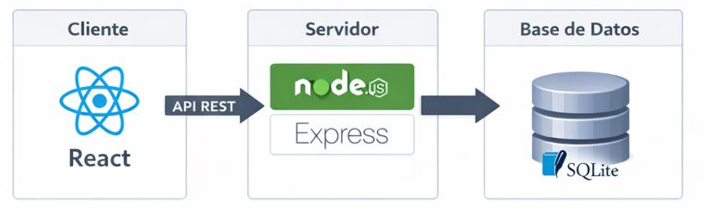

# Proyecto Intermodular - La Cancha del Saber

## Documentación Oficial

### Arquitectura

#### Diagrama

#### Diagrama de base de datos

;

| Tabla                   | Información                                   |
|-------------------------|-----------------------------------------------|
| `users`                 | Usuarios registrados                          |
| `role_names`            | Roles disponibles: user, admin                |
| `user_role`             | Relación many-to-many entre usuarios y roles  |
| `categorías`            | Categorías de las preguntas                   |
| `dificultades`          | Dificultades de las preguntas                 |
| `preguntas`             | Preguntas del juego                           |
| `partidas`              | Puntuaciones obtenidas en las partidas        |
| `partida_respuestas`    | Respuestas obtendas en las partidas           |
| `amistades`             | Amistades entre usuarios                      |

#### Tecnologías

* Frontend: **HTML** + **CSS** + **jQuery/JavaScript**
* Backend: **PHP**
* Base de datos: **MySQL**
* Entorno de desarrollo: **Contenedores Docker**
* Despliegue de la aplicación: **AWS**
* Documentación: **GitHub Pages**

[Volver](index.md)
