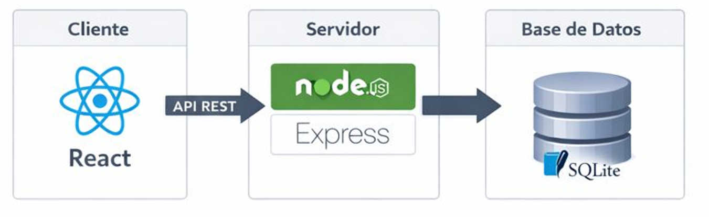

# Proyecto Intermodular
# Documentación Oficial

## Arquitectura

### Diagrama

### Explicación técnica
La aplicación sigue una arquitectura cliente-servidor:
* Frontend consume una API REST
* Backend gestiona la lógica y persistencia

### Tecnologías
* Frontend: React
* Backend: Node.js + Express
* Base de datos: SQLite

[Volver](index.md)