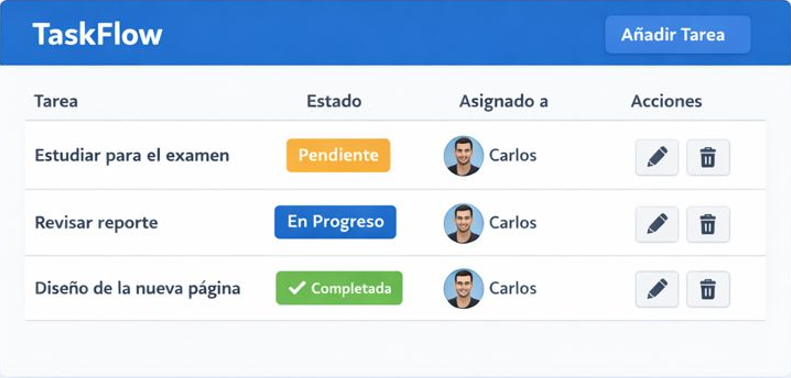

# Proyecto Intermodular
# Documentación Oficial

## Uso

### Capturas

### Casos de uso
* Crear tareas con fecha límite
* Marcar tareas como completadas
* Asignar tareas a distintos usuarios

### Usuarios tipo
* Estudiantes
* Freelancers
* Pequeños equipos de trabajo

[Volver](index.md)